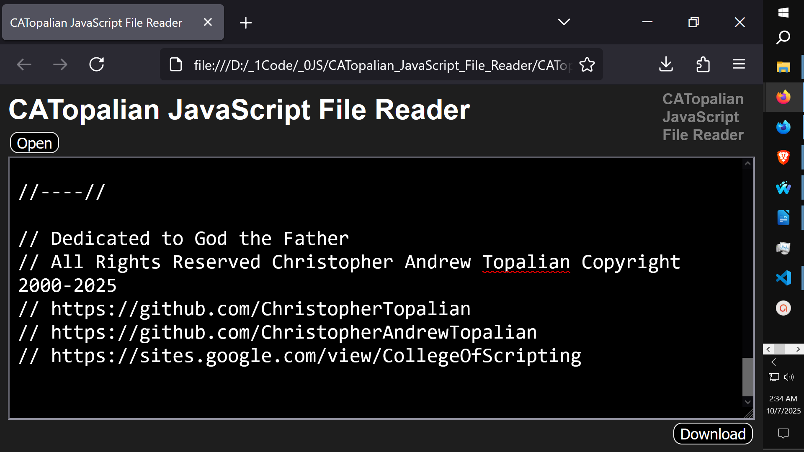

# CATopalian JavaScript File Reader
This JavaScript app allows the user to open text files, see and edit the text in the textarea and save the files.

---

---

Use App: https://christopherandrewtopalian.github.io/CATopalian_JavaScript_File_Reader/CATopalian_JavaScript_File_Reader.html

---

### How to Download this App
1. Click the green Code Button on this github page
2. Choose Download ZIP
3. Save the Zip File
4. Extract All
5. Double click the HTML file to start the App

---

Happy Scripting :-)

---

//----//  

// Dedicated to God the Father  
// All Rights Reserved Christopher Andrew Topalian Copyright 2000-2025  
// https://github.com/ChristopherTopalian  
// https://github.com/ChristopherAndrewTopalian  
// https://sites.google.com/view/CollegeOfScripting

